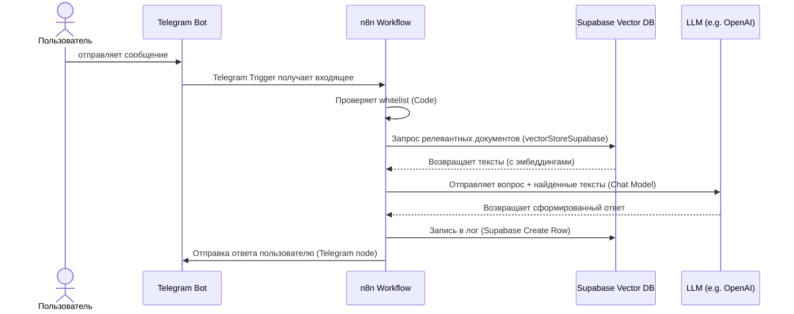

# Краткий обзор  
Это задание — построить минимальный (MVP) чат-бот с RAG-архитектурой на n8n и Supabase, доступный через Telegram, и запустить его сначала локально (Docker/WSL), а затем на Hugging Face Spaces в Docker-контейнере. Цель — быстро реализовать базовые функции:  
- Получение вопроса от пользователя через Telegram.  
- Поисковый запрос к векторной базе Supabase (pgvector) для извлечения релевантных документов.  
- Генерация ответа через LLM (например, OpenAI или Hugging Face) с учётом найденных источников.  
- Отправка ответа обратно пользователю в Telegram.  
- Логирование запросов и ответов в Supabase (таблица с логами).  
- Реализация простейшей авторизации (белый список Telegram ID).  

Схема работы: пользователь пишет боту, n8n через Telegram Trigger получает сообщение, проверяет ID в коде (или через настройки узла «Telegram Trigger» с полем «Restrict to User IDs»), ищет информацию в Supabase Vector Store, передаёт вопрос + найденные тексты LLM, формирует ответ (включая ссылки на источники), отправляет ответ через узел Telegram Send, затем записывает событие в Supabase (лог).  

Для развёртывания локально используется Docker Compose (контейнер n8n +, при необходимости, локальная БД или подключение к удалённой Supabase). Для HF Spaces создаётся Docker Space с настройками среды: устанавливаются переменные (DB-хост, webhook URL, ключ шифрования n8n, токены и пр.). Hugging Face рекомендует хранить секреты (API-ключи Telegram, Supabase) в настройках Spaces【43†L218-L223】.  

# MVP: минимальный набор фич и критерии успеха  
- **Телеграм-бот**: обработка входящих сообщений от одного бота (API-токен в креденшлах n8n), отправка ответов.  
- **Авторизация**: белый список Telegram User ID. Можно реализовать двумя способами: задать разрешённые ID в поле «Restrict to User IDs» узла Telegram Trigger (кроме Bot Token это настройка узла) или сделать проверку в Function/Code-узле (напр. примитивный BotGuard【62†L84-L88】). Если ID не в списке, бот должен отвечать «доступ запрещён» (и опционально уведомлять админа).  
- **Поиск RAG**: хранятся заранее созданные векторы документов (3–50 документов, текстовых файлов) в Supabase (таблица с полями content, embedding, metadata и т.п.). Запрос пользователя обрабатывается узлом **Supabase Vector Store** (операция «Retrieve Documents (As Vector Store for Chain/Tool)»), который возвращает топ-N наиболее релевантных документов【27†L856-L864】. (MVP: 3–5 документов.)  
- **LLM**: формирование ответа по найденным документам. Через узел чат-модели (например, **OpenAI Chat Model** или **Hugging Face Inference Model**) передаются вопрос + контекст. Для упрощения можно склеить текст найденных документов (соглашения: добавить разделители, источники). Например: шаблон системного сообщения: «Answer the user based on the following context: ...» и вставлять `{{$json["text"]}}` из предыдущего узла (или создавать через Code node готовую подсказку).  
- **Шаблоны ответов**: можно использовать встроенные выражения n8n (`{{$node["..."].json["..."]}}`) прямо в поле «Message» узла Telegram Send для подстановки данных. Для более сложного форматирования можно использовать узел «HTML» или community-узел **Document Generator** (Handlebars)【46†L49-L57】. MVP можно ограничиться одним полем сообщений, например:  
  ```
  Привет, {{$json["from"]["first_name"]}}! По вашему вопросу нашлось {{$items("Supabase Vector Search").length}} документов. Ответ: {{$json["answer"]}}
  ```
- **Логирование**: каждый запрос (пользовательский вопрос, ответ, метаданные, статус) записывается в базу. Для MVP подойдет один запрос к узлу **Supabase (Create a new row)**, который создаст запись в таблице «logs» с полями (user_id, question, answer, timestamp, success_flag). Узел Supabase поддерживает операции создания/получения строк【64†L1523-L1531】【64†L1542-L1547】.  
- **Оценка времени**: MVP можно собирать за несколько вечеров (2–3 дня работы), если заранее подготовить несколько документов для индексации. Особое внимание — настройке n8n и Docker.  

Критерии успеха MVP: бот получает вопрос и даёт связный ответ, при этом ответ сопровождается ссылками/источниками на найденные документы (или номерами источников). Вход без ответа недопустим (даже «не знаю»). Все ключи/пароли хранятся в переменных окружения или секретах, не в коде.  

# Пошаговая настройка локального окружения (Docker + WSL)  

1. **Установить Docker Desktop (WSL2)**. На Windows рекомендован WSL2 + Docker Desktop. На Linux достаточно Docker+Docker Compose.  
2. **Подготовить базу Supabase**. Для локальной разработки можно быстро запустить Supabase «all-in-one» контейнер (через [Supabase CLI](https://supabase.com/docs/guides/local-development) или [docker-compose](https://github.com/supabase/supabase/tree/master/docker)). Но проще — создать бесплатный проект в облачном Supabase (https://app.supabase.com). Создать проект, получить URL и ключ (токен `SERVICE_ROLE` для записи и `anon` для чтения). Создать таблицу `documents` (поле `content` текст, `embedding` вектор, опционально `metadata`). Создать таблицу `logs` (id, user_id, question, answer, timestamp).  
3. **Настроить n8n-контейнер**. Создадим `docker-compose.yml` с сервисом n8n:  

   ```yaml
   version: '3.8'
   services:
     n8n:
       image: n8nio/n8n:latest
       container_name: n8n
       ports:
         - "5678:5678"
       environment:
         - GENERIC_TIMEZONE=Europe/Moscow
         - N8N_ENCRYPTION_KEY=${N8N_ENCRYPTION_KEY}
         - WEBHOOK_URL=${WEBHOOK_URL}       # пример: https://<Ваш-домен>/
         - DB_TYPE=postgresdb
         - DB_POSTGRESDB_HOST=${DB_POSTGRESDB_HOST}
         - DB_POSTGRESDB_PORT=${DB_POSTGRESDB_PORT}
         - DB_POSTGRESDB_DATABASE=${DB_POSTGRESDB_DATABASE}
         - DB_POSTGRESDB_USER=${DB_POSTGRESDB_USER}
         - DB_POSTGRESDB_PASSWORD=${DB_POSTGRESDB_PASSWORD}
       volumes:
         - n8n_data:/home/node/.n8n
   volumes:
     n8n_data:
   ```
   
   Где:  
   - `N8N_ENCRYPTION_KEY` — любая случайная строка (для шифрования данных).  
   - `WEBHOOK_URL` — публичный адрес вашего сервера (используется Telegram и др. вебхукам). При локальном запуске может не потребоваться, но для HF Spaces нужен.  
   - `DB_...` переменные — параметры подключения к Postgres (включая Supabase). Если вы используете облачный Supabase, хост, порт, имя БД, пользователя, пароль можно взять из панели (обычно порты 5432 или 6543).  
   Пример (Supabase):  
   ```env
   N8N_ENCRYPTION_KEY=YOUR_KEY
   WEBHOOK_URL=https://my-bot.local/        # если есть публичный доступ
   DB_POSTGRESDB_HOST=db.supabase.co
   DB_POSTGRESDB_PORT=5432
   DB_POSTGRESDB_DATABASE=postgres
   DB_POSTGRESDB_USER=postgres
   DB_POSTGRESDB_PASSWORD=your_supabase_password
   ```
   Затем `docker-compose up -d`. n8n доступен на `http://localhost:5678`.  

4. **Telegram Bot API-ключ**. Зарегистрируйте бота через @BotFather, получите токен и добавьте его в креденшлы n8n. В UI n8n перейдите **Credentials → Telegram Bot**, вставьте токен.  

5. **Проверка входящих сообщений**. Добавьте в n8n рабочий поток узел **Telegram Trigger**. В его настройках выберите креденшл с токеном. По умолчанию он будет слушать входящие сообщения. Добавьте, например, узел **Set** после триггера, чтобы проверить выходные данные: в поле `Message` введите `{{$json["message"]["text"]}}`. Активируйте workflow, отправьте боту `/start`. n8n должен получить сообщение.  

6. **Whitelist Telegram**. В узле Telegram Trigger можно указать опцию **Restrict to User IDs**, перечислив разрешённые Telegram ID (разделитель — запятая)【20†L1602-L1605】. Альтернатива — после триггера вставить **Function** или **Function Item** узел (на JavaScript) с проверкой ID:  

   ```js
   const allowed = [123456789, 987654321]; // Ваши userId
   if (allowed.includes($json["message"]["from"]["id"])) {
     return items;
   } else {
     throw new Error("User not allowed");
   }
   ```

   При отказе можно использовать два выхода из узла (один для разрешённых, второй — для запрещённых) и разветвление (IF) либо с нодами «Send Message» для уведомления, как в примере BotGuard【62†L84-L88】.  

7. **Подключение Supabase**. В n8n создайте креденшл **Postgres** (App Nodes) с параметрами вашей Supabase: Host, Port, Database, User, Password. (Или используйте креденшл **Supabase** из App Nodes, если доступен.) Можно оставить SSL mode OFF для простоты (Supabase позволяет). Проверьте соединение с помощью узла **Postgres** (или Supabase) и операцией **Get All Rows** на тестовом запросе.  

8. **Индексация документов**. Для MVP вручную загрузите несколько документов (txt) и их embeddings в Supabase (можно использовать Python/LangChain или Supabase SQL). Например, добавить через SQL (`INSERT`) пару текстов и их векторов (обученных на выбранной модели). После этого в n8n можно создать рабочий поток с узлами **Supabase Vector Store** (или **Supabase** + прямой SQL с вызовом функции поиска вектора). n8n предлагает отдельный узел **Vector Store**: в нём задайте Operation = «Insert Documents» и укажите таблицу. В нашем случае можно сделать это один раз вручную перед демо.  

# Развёртывание на Hugging Face Spaces (Docker)  

HuggingFace Spaces поддерживают окружение Docker. Пример готового шаблона n8n приведён [здесь](https://huggingface.co/spaces/tomowang/n8n)【37†L129-L137】【43†L218-L223】. Основные шаги:  

1. **Создайте новый Space** с SDK «Docker». (Либо дублируйте шабон Tomo Wang, как описано в [README](https://huggingface.co/spaces/tomowang/n8n)【37†L129-L137】.)  
2. **Dockerfile**. Пример (на основе официального n8n Docker):  

   ```dockerfile
   FROM docker.n8n.io/n8nio/n8n:stable
   ENV N8N_ENFORCE_SETTINGS_FILE_PERMISSIONS=true \
       N8N_RUNNERS_ENABLED=true \
       N8N_PROXY_HOPS=1
   USER node
   VOLUME ["$HOME/.n8n"]
   EXPOSE 5678
   ENTRYPOINT ["tini", "--", "/docker-entrypoint.sh"]
   ```

   Этот Dockerfile использует пользователя `node` (UID 1000), выставляет стандартные порты и переменные (примеры в [33†L55-L63]).

3. **Переменные окружения и секреты**. В настройках Space задайте переменные (раскрыть «Settings» → Variables/Secrets). По примеру [37]L129-137, нужны:  
   - `DB_POSTGRESDB_HOST`, `DB_POSTGRESDB_PORT`, `DB_POSTGRESDB_DATABASE`, `DB_POSTGRESDB_USER`, `DB_POSTGRESDB_PASSWORD` – параметры Supabase-базы.  
   - `N8N_ENCRYPTION_KEY` – случайная строка (`openssl rand -base64 32` для генерации).  
   - `WEBHOOK_URL` – URL вашего пространства (напр. `https://<имя>-n8n.hf.space/`).  
   - `N8N_EDITOR_BASE_URL` – тот же домен (нужен для UI-хуков внутри).  
   - `GENERIC_TIMEZONE`, `TZ` – по требованию (напр. `Europe/Moscow`).  
   Секреты (Token’ы Telegram, Supabase API key и т.д.) следует поместить как **Secrets** (в HF: вкладка Settings → Secrets). В Dockerfile их можно монтировать и читать как `$(cat /run/secrets/SECRET_NAME)`【43†L193-L202】【43†L218-L223】. В рантайме секреты автоматически доступны как обычные переменные окружения.  

4. **Развёртывание**. После указания всех переменных нажмите «Deploy». После сборки и запуска Space будет доступен по указанному URL (он указан в `N8N_EDITOR_BASE_URL` и `WEBHOOK_URL`). Учтите: статическая файловая система в Docker Space не сохраняется между рестартами, поэтому все данные — во внешней базе. n8n по умолчанию использует PostgreSQL (Supabase) как хранилище историй и данных, что решает проблему «засыпания» Space【37†L80-L88】【43†L290-L298】.  

5. **Права доступа UI**. Обратите внимание, что n8n в режиме production устанавливает заголовок безопасности `X-Frame-Options: sameorigin`, что может блокировать работу UI в iframe Spaces【37†L152-L154】. Это нормально (можно открывать прямо).  

# Диаграмма процессов (последовательность в стиле swimlanes)  

Ниже приведена упрощённая последовательная диаграмма (Mermaid) для основных акторов и этапов:  



Эта диаграмма показывает, что **пользователь** взаимодействует с **Telegram Bot**, который триггерит **n8n**. Дальше идут обращения к **Supabase** и **LLM**, после чего n8n отправляет ответ и логирует запрос.  

# Список узлов n8n с настройками и примеры  

Ниже основные узлы, которые понадобятся:  

- **Telegram Trigger** (Trigger Node) – слушает сообщения от бота. Настройки: выбрать креденшл Telegram, тип триггера «Message» или «Bot Message», задать (опционально) **Restrict to User IDs** для whitelist【20†L1602-L1605】. На выходе доступно `{{$json["message"]["text"]}}` (текст), `{{$json["message"]["from"]["id"]}}` (ID пользователя) и пр.  
  **Пример JSON узла (фрагмент)**:  
  ```json
  {
    "name": "Telegram Trigger",
    "type": "n8n-nodes-base.telegramTrigger",
    "parameters": {
      "triggerOn": "message",
      "options": {
        "restrictToUserIds": "123456789,987654321"
      }
    },
    "credentials": {
      "telegramApi": {
        "id": "Telegram Account",
        "botToken": "={{$secrets.TELEGRAM_BOT_TOKEN}}"
      }
    }
  }
  ```
  *(Тут `restrictToUserIds` – белый список ID (пример).)*  

- **Function/Code (JS)** – для произвольной логики. Например, узел «Function Item» можно использовать для whitelist и ветвления. В простейшем случае:  
  ```js
  const allowed = [123456789, 987654321];
  if (allowed.includes($json["from"]["id"])) {
    return items;
  } else {
    return []; // или обработка «не разрешено»
  }
  ```  
  Либо разделить на два выхода: разрешён/неразрешён. [См. пример BotGuard【62†L84-L88】].  

- **Supabase Vector Store** (n8n-nodes-langchain.vectorstoresupabase) – официальный узел LangChain для работы с векторной базой Supabase. **Operation**: «Retrieve Documents (As Vector Store for Chain/Tool)» (или «Get Many»). Задайте **Table Name** (например, `documents`), **Query** – выражение из поля триггера `={{$json["message"]["text"]}}`. Можно указать `Return Fields`, `Metadata Filter`. На выходе получаете список документов с текстом и embedding.  
  Пример:  
  ```json
  {
    "name": "Supabase Vector Search",
    "type": "n8n-nodes-langchain.vectorstoresupabase",
    "parameters": {
      "operation": "retrieveDocument",
      "tableName": "documents",
      "query": "={{$json[\"message\"][\"text\"]}}",
      "matchCount": 5
    },
    "credentials": {
      "supabase": { "projectUrl": "https://your.supabase.co", "apiKey": "={{$secrets.SUPABASE_SERVICE_KEY}}" }
    }
  }
  ```  
  Этот узел вернёт поля (например, content, source). Подробнее о параметрах см. документацию n8n【27†L856-L864】.  

- **LLM (Chat Model)** – узел чат-LLМ, напр. **OpenAI Chat** (или **Hugging Face Inference**). Настройка: креденшл OpenAI/HuggingFace, модель (gpt-3.5/Claude/Gemini), параметры. В «Prompt» передаём формулировку с вопросом и источниками. Например, в поле «Message»:  
  ```
  Вопрос: {{$json["message"]["text"]}}. Контекст: {{$node["Supabase Vector Search"].json["content"]}}. Дай полный ответ и упомяни источник.
  ```  
  Используем выражения n8n (Mustache) для подстановки. Либо собрать строку через Code-узел. Например:  
  ```json
  {
    "name": "OpenAI Chat",
    "type": "n8n-nodes-base.openAIApi",
    "parameters": {
      "resource": "chatCompletion",
      "operation": "create",
      "model": "gpt-3.5-turbo",
      "messages": [
        {"role": "system", "content": "Ты AI-помощник, отвечай по контексту."},
        {"role": "user", "content": "Context: {{$node[\"Supabase Vector Search\"].json[\"content\"]}}. Question: {{$json[\"message\"][\"text\"]}}"}
      ]
    },
    "credentials": {
      "openAIApi": {
        "id": "OpenAI Account",
        "apiKey": "={{$secrets.OPENAI_API_KEY}}"
      }
    }
  }
  ```  

- **Set (или HTML, Markdown)** – узел для форматирования ответа. Можно просто взять `{{$json["choices"][0]["message"]["content"]}}` из OpenAI. Установить конкретную структуру сообщения для Telegram. Например:  
  ```json
  {
    "name": "Prepare Answer",
    "type": "n8n-nodes-base.set",
    "parameters": {
      "values": {
        "string": [
          { "name": "answer", "value": "{{$node[\"OpenAI Chat\"].json[\"choices\"][0][\"message\"][\"content\"]}}" }
        ]
      }
    }
  }
  ```  

- **Telegram** (Send Message) – узел отправки сообщения в Telegram. Настройки: credentials Telegram, Target Chat ID (обычно `{{$json["message"]["from"]["id"]}}` из Trigger), Text – `={{$node["Prepare Answer"].json["answer"]}}`. Можно настроить `Reply Markup` для кнопок (см. ниже). Пример:  
  ```json
  {
    "name": "Telegram Send",
    "type": "n8n-nodes-base.telegram",
    "parameters": {
      "chatId": "={{$json[\"message\"][\"from\"][\"id\"]}}",
      "text": "={{$node[\"Prepare Answer\"].json[\"answer\"]}}"
    },
    "credentials": {
      "telegramApi": { "id": "Telegram Account", "botToken": "={{$secrets.TELEGRAM_BOT_TOKEN}}" }
    }
  }
  ```  

- **Supabase** (App Node) – узел для работы с самой базой данных (не векторов). Например, **Create Row** для логирования. Настройки: операция „Create“, Table=«logs», Columns/Values: `user_id: {{$json["message"]["from"]["id"]}}`, `question: {{$json["message"]["text"]}}`, `answer: {{$node["Prepare Answer"].json["answer"]}}`, `timestamp: {{$now}}` и т.д. Пример:  
  ```json
  {
    "name": "Log to Supabase",
    "type": "n8n-nodes-base.supabase",
    "parameters": {
      "operation": "insert",
      "table": "logs",
      "columns": "user_id,question,answer",
      "values": "={{$json[\"message\"][\"from\"][\"id\"]}},{{$json[\"message\"][\"text\"]}},{{$node[\"Prepare Answer\"].json[\"answer\"]}}"
    },
    "credentials": {
      "supabaseApi": { "apiKey": "={{$secrets.SUPABASE_SERVICE_KEY}}", "projectUrl": "https://your.supabase.co" }
    }
  }
  ```  

- **Expression Templates**. В большинстве узлов можно писать шаблоны с `{{$ ... }}` (Handlebars-подобные). Например, в Telegram-Send мы уже использовали `={{...}}`. Это и есть встроенные шаблоны n8n. Дополнительно можно создавать **Workflow Templates**: экспортировать JSON (см. раздел «templates» в UI) и импортировать как заготовку. Также есть community-узел **Document Generator** для более сложных шаблонов на Handlebars【46†L49-L57】, но для MVP достаточно нативных `{{$json[...]}}`.  

# Готовые узлы и пробелы (Built-in vs Code)  

| Задача                        | Встроенные узлы                                | Нужен Code node?                              |
|------------------------------|-----------------------------------------------|----------------------------------------------|
| **Telegram Inbound/Outbound**| Узел *Telegram Trigger/Telegram Send*         | Не требуется (низкоуровневый доступ к Bot API через креденшлы) |
| **Авторизация (Whitelist)**  | В узле *Telegram Trigger* есть поля `restrictToUserIds` и `restrictToChatIds`【20†L1602-L1605】; либо использовать узел *Function* для гибкой проверки | Код нужен, если логика сложнее (например, уведомления админов, работа с несколькими чатами) |
| **Поиск RAG (Supabase Vector)**| Узел *Supabase Vector Store* (LangChain)【27†L856-L864】 выполняет вставку и поиск. | Код не нужен, этот узел покрывает вставку/поиск в pgvector. |
| **LLM (Chat Model)**         | Узлы *OpenAI Chat*, *HuggingFace Inference* и др. | При необходимости специфических цепочек (контексты, конкатенация) можно использовать *Function*, но обычно встроенные узлы достаточны. |
| **Форматирование ответа**    | Узел *Set* (использует выражения `{{$...}}`), *HTML* или *Markdown* | Код не обязателен. Для сложного форматирования (PDF, шаблоны документов) могут потребоваться расширения, но для текста хватит Set/Function. |
| **Логирование (Supabase)**   | Узел *Supabase (Create Row, Get Row и т.д.)*【64†L1523-L1531】【64†L1542-L1547】 | Если нужны сложные SQL-запросы – можно использовать *HTTP Request* с REST API Supabase или *Function* для динамической генерации. |
| **Кнопки/Inline Keyboard**   | Нет прямой поддержки в родных узлах (нужно JSON в ReplyMarkup) | Для динамических inline-кнопок часто применяют узел *HTTP Request* (запрос к https://api.telegram.org/bot<TOKEN>/sendMessage с полем `reply_markup`)【51†】 |
| **Оценка ответа/аналитика**  | Нет специализированного узла | Можно логировать голос/рейтинг через кнопки (Callback Query) и обрабатывать их функцией. Требуется custom logic. |

Большинство задач закрывается встроенными узлами n8n (низкодополнительный подход), что ускоряет разработку. Дополнительный код потребуется для:  
- Комплексной бизнес-логики (ветвления, фильтры).  
- Кастомных форматов сообщений (inline-кнопки, сложные структуры).  
- Любых действий, не покрытых узлами (например, специфичный API-запрос к стороннему сервису) – тогда используют *HTTP Request* или *Function*.  

# Белый список Telegram (Whitelist)  

Белый список — это список **Telegram User ID** (не ключей API). n8n обрабатывает его двумя способами:  

- **Узел Telegram Trigger:** в настройках (Options) есть поля *Restrict to Chat IDs* и *Restrict to User IDs*【20†L1602-L1605】. Можно вписать через запятую разрешённые ID чатов или пользователей. Бот просто не будет триггериться от сообщений от других ID.  
- **Function/Code:** после получения сообщения (в триггере) вставить узел *Function*, который проверяет `$json["from"]["id"]`. Пример, как в шаблоне «BotGuard» n8n (см. [62†L84-L88]): ненулевые попытки от неразрешённых пользователей заканчиваются ответом «Access Denied» и уведомлением админа.  

Таким образом, в whitelist попадают реальные номера аккаунтов (numeric userId). Ключи (Bot Token) — это отдельная настройка креденшлов и не относятся к whitelist.  

# Шаблоны (Templates) и ответы по шаблону  

- **Workflow templates:** Экспорт/импорт всего workflow как JSON (в UI – «Templates»). Это позволяют подготовленные примеры из n8n (в том числе BotGuard【62†L84-L88】 и др.) выкладывать шаблоны, которые можно клонировать.  
- **Шаблоны документов:** n8n не имеет «Built-in» генератора документов MS Office, но есть community-узлы (например, Document Generator с Handlebars)【46†L49-L57】. Можно использовать готовые документы с заполнителем и Code node с библиотекой, но для MVP достаточно текста.  
- **Выражения n8n:** Любое текстовое поле узла (например, Message для Telegram) поддерживает Mustache-подобный синтаксис `{{ ... }}` (n8n заменит `{{$json[...]}}` на данные). Это основной способ «подстановки шаблонов». Например, шаблон для ответа: `Здравствуйте, {{$json["from"]["first_name"]}}! По вашему запросу найдены следующие документы: ...`  
- **Шаблон ответов:** Для автоматической вставки данных в ответ бота используйте узел *Set* или прямо в параметре «Text» узла Telegram напишите:  
  ```
  Ответ: {{$node["OpenAI Chat"].json["choices"][0]["message"]["content"]}}
  ```
  Это позволит n8n подставить сгенерированный LLM ответ.  

# Пример минимального JSON workflow (MVP)  

Ниже фрагмент минимального workflow (для импорта в n8n), показывающий ключевые узлы:  

```json
{
  "nodes": [
    {
      "name": "Telegram Trigger",
      "type": "n8n-nodes-base.telegramTrigger",
      "parameters": {
        "triggerOn": "message",
        "options": {
          "restrictToUserIds": "123456789"  // ваш ID
        }
      },
      "credentials": {
        "telegramApi": {
          "id": "Telegram Account",
          "botToken": "={{$credentials.telegramApi.botToken}}"
        }
      }
    },
    {
      "name": "Check Whitelist",
      "type": "n8n-nodes-base.function",
      "parameters": {
        "functionCode": "const allowed=[123456789]; if(allowed.includes($json.from.id)){return items;} else {throw new Error('Access denied');}"
      }
    },
    {
      "name": "Supabase Vector Search",
      "type": "n8n-nodes-langchain.vectorstoresupabase",
      "parameters": {
        "operation": "retrieveDocument",
        "tableName": "documents",
        "query": "={{$json[\"message\"][\"text\"]}}",
        "matchCount": 5
      },
      "credentials": {
        "supabase": {
          "projectUrl": "https://<your>.supabase.co",
          "apiKey": "={{$credentials.supabase.apiKey}}"
        }
      }
    },
    {
      "name": "OpenAI Chat",
      "type": "n8n-nodes-base.openAIApi",
      "parameters": {
        "operation": "create",
        "model": "gpt-3.5-turbo",
        "messages": [
          { "role": "system", "content": "Вы AI-ассистент." },
          { "role": "user", "content": "{{$json[\"message\"][\"text\"]}} Context: {{$node[\"Supabase Vector Search\"].json[\"content\"]}}" }
        ]
      },
      "credentials": {
        "openAIApi": { "apiKey": "={{$credentials.openAIApi.apiKey}}" }
      }
    },
    {
      "name": "Prepare Answer",
      "type": "n8n-nodes-base.set",
      "parameters": {
        "values": {
          "string": [
            { "name": "answer", "value": "={{$node[\"OpenAI Chat\"].json[\"choices\"][0][\"message\"][\"content\"]}}" }
          ]
        }
      }
    },
    {
      "name": "Telegram Send",
      "type": "n8n-nodes-base.telegram",
      "parameters": {
        "chatId": "={{$json[\"message\"][\"from\"][\"id\"]}}",
        "text": "={{$node[\"Prepare Answer\"].json[\"answer\"]}}"
      },
      "credentials": {
        "telegramApi": {
          "id": "Telegram Account",
          "botToken": "={{$credentials.telegramApi.botToken}}"
        }
      }
    },
    {
      "name": "Log to Supabase",
      "type": "n8n-nodes-base.supabase",
      "parameters": {
        "operation": "insert",
        "table": "logs",
        "columns": "user_id,question,answer",
        "values": "={{$json[\"message\"][\"from\"][\"id\"]}},{{$json[\"message\"][\"text\"]}},{{$node[\"Prepare Answer\"].json[\"answer\"]}}"
      },
      "credentials": {
        "supabaseApi": { "apiKey": "={{$credentials.supabase.apiKey}}", "projectUrl": "https://<your>.supabase.co" }
      }
    }
  ],
  "connections": {
    "Telegram Trigger": { "main": [[{"node":"Check Whitelist","type":"main","index":0}]] },
    "Check Whitelist": { "main": [[{"node":"Supabase Vector Search","type":"main","index":0}]] },
    "Supabase Vector Search": { "main": [[{"node":"OpenAI Chat","type":"main","index":0}]] },
    "OpenAI Chat": { "main": [[{"node":"Prepare Answer","type":"main","index":0}]] },
    "Prepare Answer": { "main": [[{"node":"Telegram Send","type":"main","index":0}]] },
    "Telegram Send": { "main": [[{"node":"Log to Supabase","type":"main","index":0}]] }
  }
}
```

Этот пример демонстрирует минимальный поток: от Telegram → проверка ID → поиск в Supabase → LLM → ответ → лог. В реальном потоке могут быть дополнительные IF или ноды фильтрации в зависимости от задачи.  

# Чек-лист развертывания и отладки  

- **Локально**: убедиться, что n8n контейнер поднимается, доступны журналы (`docker logs`), можно зайти в веб-интерфейс. Проверьте соединение с базой: используйте узел *Postgres* в n8n для простого SELECT. Тестируйте последовательность узлов по-отдельности (через Debug mode).  
- **Telegram**: после запуска workflow отправьте боту сообщение и убедитесь, что Telegram Trigger получает событие (смотрите панель Execution n8n). Если нет — проверьте, правильно ли указан Bot Token и WEBHOOK_URL. (На локальном можно использовать ngrok для публичного URL).  
- **Supabase**: протестируйте узел Vector Store: временно замените LLM на простую запись `{{">" + $json["message"]["text"]}}` чтобы убедиться, что поиск работает.  
- **HF Spaces**: в логе запуска контейнера (строках build) можно увидеть ошибки подключения к БД или отсутствии окруж. Перепроверьте, что все env var заданы. Убедитесь, что в Dockerfile монтируется пользователь и работает под ним (см. [43†L227-L236]).  
- **Secrets**: все токены (Telegram, OpenAI, Supabase) нужно определить в Secrets Settings HF (или в .env локально). Проверьте, что n8n действительно получает переменные: можно вставить узел *Set* с `{{$secrets...}}` или временный *Function* с `console.log(process.env)`【43†L218-L223】.  
- **Ошибки**: в ui n8n можно смотреть исполнение узлов (red nodes). Общие проблемы: неверный формат JSON, ошибки привязки узлов, превышение лимита запросов OpenAI и т.д. Ключевое: смотреть n8n-логи (в Docker `docker logs n8n`).  

# Полезные ссылки и ресурсы  

- **n8n Docs**: [Telegram Trigger](https://docs.n8n.io/integrations/builtin/trigger-nodes/n8n-nodes-base.telegramtrigger)【20†L1602-L1605】, [Supabase App Node](https://docs.n8n.io/integrations/builtin/app-nodes/n8n-nodes-base.supabase)【64†L1523-L1531】【64†L1542-L1547】, [Supabase Vector Store (LangChain)](https://docs.n8n.io/integrations/builtin/cluster-nodes/root-nodes/n8n-nodes-langchain.vectorstoresupabase)【27†L856-L864】, [OpenAI](https://docs.n8n.io/integrations/builtin/app-nodes/n8n-nodes-base.openAIApi) и пр.  
- **Hugging Face Spaces**: [Spaces Docker Guide](https://huggingface.co/docs/hub/spaces-sdks-docker) – общие принципы, управление секретами【43†L218-L223】; [Пример n8n on Spaces](https://huggingface.co/spaces/tomowang/n8n/blob/main/README.md)【37†L129-L137】 с переменными окружения.  
- **Supabase**: [Документация Supabase](https://supabase.com/docs) (особенно про векторную БД «pgvector» и REST API).  
- **Telegram Bot API**: описание объектов сообщений (для полей `chat_id`, `reply_markup` и пр.) – [Bot API](https://core.telegram.org/bots/api). В n8n ноды уже используют эту схему.  
- **Примеры и шаблоны**: Workflow BotGuard (телеграм-белый список)【62†L84-L88】; примеры RAG с n8n+Supabase (ютуб [59†], блог [3]).  

Используя вышеперечисленные шаги, документацию и примеры, можно быстро собрать рабочий MVP чат-бота на основе n8n, Telegram и Supabase, а затем портировать его в контейнер на Hugging Face Spaces. Следуйте принципам минимальных изменений (keep it simple), доверяйте встроенным узлам, и при необходимости расширяйте их через JavaScript-код. Удачного кодирования!  

**Источники:** официальная документация n8n【20†L1602-L1605】【64†L1523-L1531】, примеры workflow (Telegram BotGuard)【62†L84-L88】, документация Hugging Face Spaces【37†L129-L137】【43†L218-L223】.